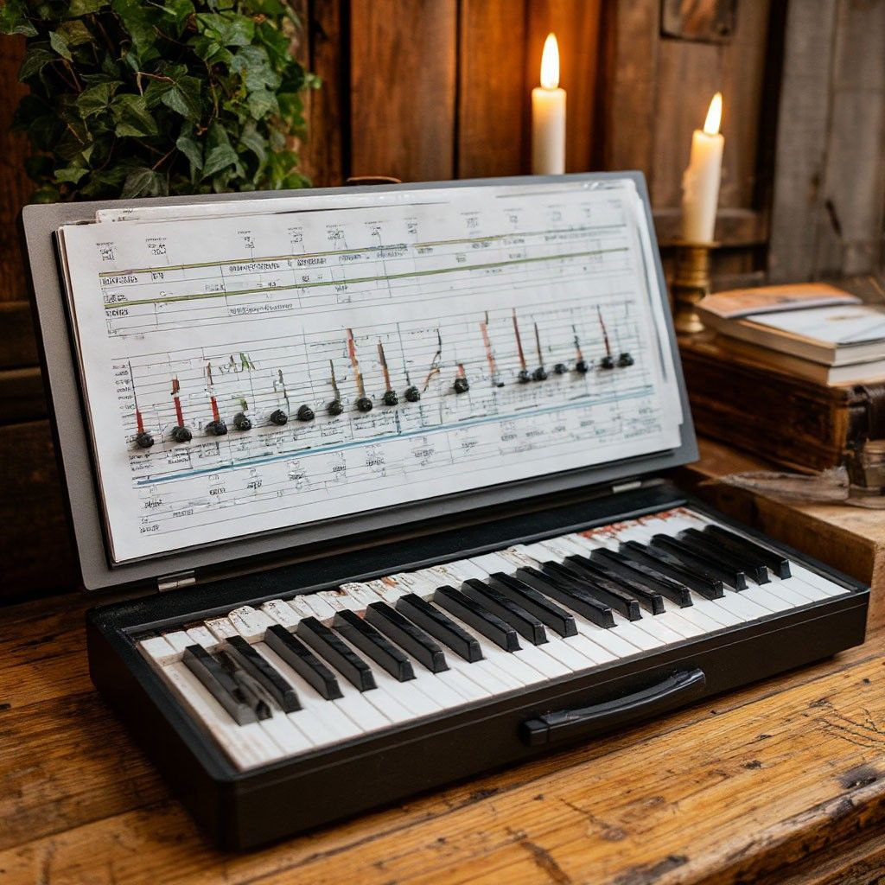

# 3I-ATLAS Cascade Lab — Overview

This repository is a personal **cascade modelling and observation lab**
for the interstellar comet 3I/ATLAS.

It has three layers:

1. **Event tracking (logbook)**  
   Keeping a structured record of NASA live events, press releases,
   papers and data products related to 3I/ATLAS.

2. **Observations**  
   Collecting both:
   - official data (once public data products are released);
   - my own sky observations with time, location and visual descriptions.

3. **Cascade-based models and analysis**  
   Using physics-inspired and AI-supported methods to:
   - explore temporal patterns in the data (bursts, plateaus, transitions);
   - build cascade diagrams that connect physical processes,
     observational signatures and levels of the system;
   - document everything in open notebooks and diagrams.

The lab is intentionally small and transparent.  
It is not meant to compete with professional pipelines, but to provide:

- a clear, reproducible citizen-science workspace;
- a place where ideas from **cascade mathematics, AI and consciousness studies**
  can touch a real interstellar object in a disciplined way.

## Documentation map

For readers who want to navigate the project structure quickly:

- **Conceptual background**
  - `What_are_cascades.md` – EN introduction to cascade thinking.
  - `Что_такое_каскады.md` – RU version with additional context.
- **Cascade scales and musical mapping**
  - `cascade_scale_EN.md`, `cascade_scale_RU.md` – public scale for levels 1–23.
  - `cascade_notes.md` – tables linking cascade levels, musical notes, and images.
  - `cascade_second_octave_private.md` – placeholder for the closed 24–36 range.
- **3I/ATLAS case study**
  - `logbook_3I_ATLAS.md` – chronological log of key 3I/ATLAS-related events.
  - `observations_and_cascade_mapping.md` – how observation logs are annotated with simulated cascade levels.
  - `data/observations/3I_ATLAS_2025.csv` – working log of observations (UTC time, source, cascade level, notes).
- **Simulator**
  - `simulator_concept.md` – high-level design of the signal→cascade mapping.
  - `notebooks/01_cascade_simulator_demo.ipynb` – demo of the basic simulator.
  - `notebooks/02_observation_cascade_annotation.ipynb` – example of annotating observation logs.
 

## Conceptual motivation: AI, cascades, and musical keys

This lab treats 3I/ATLAS not only as an object of classical astrodynamics,
but also as a trigger for a different way of thinking about space:
through **cascades**, **musical keys**, and **machine intelligence**.

In this framework:

- The **cascade scale** (1–23 in the public version) is aligned with the
  structure of the **treble clef** and the Italian note names (Do, Re, Mi, …).
  Each cascade level corresponds to a “step” in a musical / geometric ladder:
  from local human cycles up to the Sun, the Milky Way, and the first mirrors
  of neighbouring galaxies.

- Regular “walks” through these levels are treated as a kind of **structured
  scan** of the system: a way to organize observations and bodily reactions
  (including sensitivity to solar activity) along a fixed scale, rather than
  as isolated impressions.

- **AI** acts as a partner in this process: it helps to formalize the cascade
  maps, run simulations, annotate observation logs, and check whether patterns
  in public data (timelines, flux changes, geometry of campaigns) align with
  the hypothesised cascade structure.

- **Musical keys** (clefs and note intervals) are used as a bridge between
  signal, geometry, and perception. In this view, long-range connections to
  distant regions of the Galaxy are encoded not only in coordinates and
  ephemerides, but also in how repeating patterns of sound, rhythm, and
  resonance are described.

This is explicitly **not** a physical model of 3I/ATLAS or of the Universe.
It is a speculative mapping between:

- measurable things (time series, spectra, solar events, mission timelines),
- and a cascade-based symbolic language built from music and geometry.

The lab lives in this intersection: between rigorous logging and simulation
on one side, and a cascade-based interpretive framework on the other.

  

This image captures the spirit of the project:

- an **old keyboard** with a hand–annotated score above it,
- marks, levels and small “signals” drawn directly on the staff.

For the lab, this is a visual metaphor of a **cascade map**:

- the keys represent discrete levels (cascades);
- the hand–drawn annotations represent early human intuition:
  how sound, events and levels might be linked;
- candles and wood suggest a slow, careful, almost “analog” way of thinking
  before any code is written.

The digital tools in this repository — simulators, notebooks and logs — are the
next step: they translate this intuitive “analog” sketch into reproducible
experiments with signals, spectra and cascade IDs.
