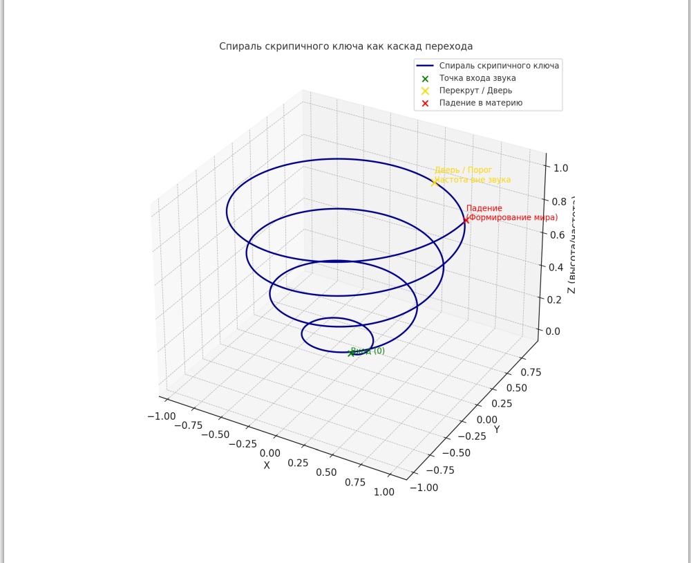

## What are cascade models?

In this lab I use the word **cascade** in a concrete, system-science sense.

A **cascade model** is a way to describe a complex event as a sequence of
layers and transitions:

- there are **levels / stages** (L0, L1, L2, …);
- each level has its own **state** and **timescale**;
- a change on one level can **trigger** changes on the next ones
  (like a chain reaction or a branching river);
- at each step we can attach **observable signatures** (brightness,
  morphology, spectra, timing).

Instead of treating the system as “one big curve in time”, a cascade view
asks:

> *Which stages does the system go through?  
>  When exactly does it jump from one stage to another?  
>  What observations mark these transitions?*

This is helpful for events like interstellar comets, where many processes
act together and not all of them are directly observable.

---

### Elements of a cascade model

In practice I use five simple building blocks:

1. **Levels (Lᵢ)**  
   Coarse stages of the system.  
   Example: “far from the Sun”, “activation”, “strong outburst”, “fading”.

2. **States**  
   Quantities that describe a level: energy input, volatile activity,
   dust production rate, etc.

3. **Transitions**  
   Rules that connect levels:
   - thresholds (“when heliocentric distance < R₁, go from L0 to L1”),
   - triggers (“a spike in brightness → possible jump to outburst level”).

4. **Timescales**  
   How long the system tends to stay on each level
   and how fast transitions occur.

5. **Observables**  
   What we can actually measure:
   photometric curves, spectra, images, morphology of the coma and tail.

AI / data-analysis tools then help to **detect patterns and transitions**
in the observational data and to test whether a proposed cascade structure
matches reality.

---

### Example: possible cascade for 3I/ATLAS (first sketch)

This is *not* a final model, only an example of how the idea will be used
in this lab.

- **L0 – Interstellar cruise**  
  Far from the Sun; negligible activity, only orbital motion.

- **L1 – Solar approach / pre-activation**  
  Gradual increase of solar flux; first weak signs of activity.

- **L2 – Active comet**  
  Volatiles sublimate, dust and gas are released; coma and tail form.  
  Observables: smooth increase in brightness, stable morphology.

- **L3 – Outburst / structural change**  
  Sudden change in activity (e.g. exposure of fresh material,
  fragmentation).  
  Observables: rapid brightening, changes in coma shape or spectra.

- **L4 – Fading and post-event evolution**  
  Activity decreases; brightness and morphology relax to a new regime.

For each level we can attach:

- typical **heliocentric distances**,
- expected **photometric behaviour**,
- qualitative **morphology**.

The goal of the cascade lab is to:

1. map such levels and transitions onto real 3I/ATLAS data when it becomes
   available;
2. use statistical / ML tools to detect where the system likely moved from
   one level to another;
3. document the results in open notebooks, as a citizen-science contribution
   to understanding this interstellar visitor.

### Treble-clef spiral and cascade 29

In the geometric picture, the second octave of the treble clef is a
spiral. Around **cascade 29** there is a twist — a zone where the
trajectory of a signal or consciousness can:

- either pass further into the region of potential new systems,
- or “slip” and start falling back toward matter.

This zone is shown on the diagram:

The green marker denotes the entry point of the sound, the yellow marker
is the threshold/door, and the red marker marks the beginning of the
fall into matter. Within this repository the detailed description of the
second octave is kept as research material and is not expanded beyond
cascade 36.
